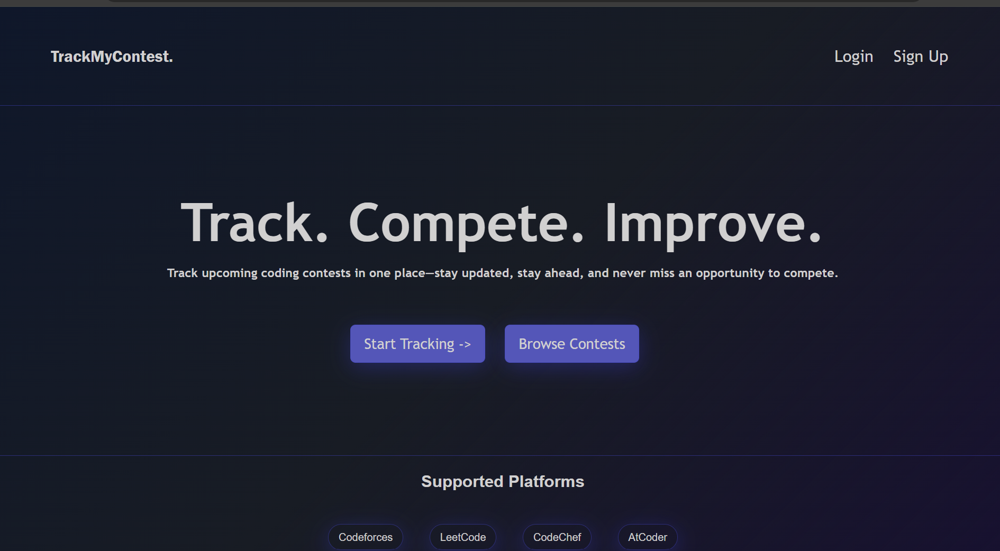
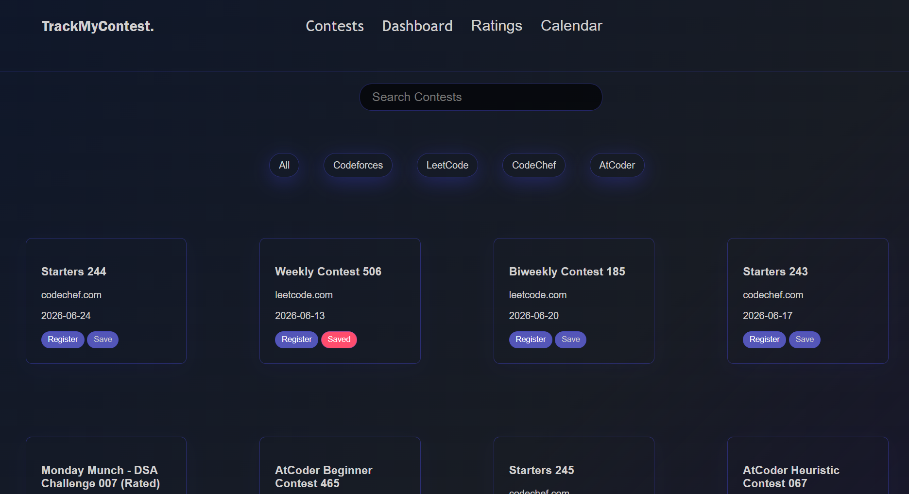
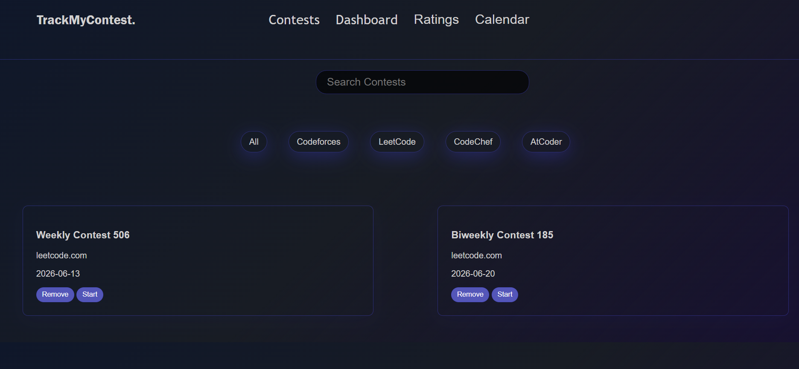
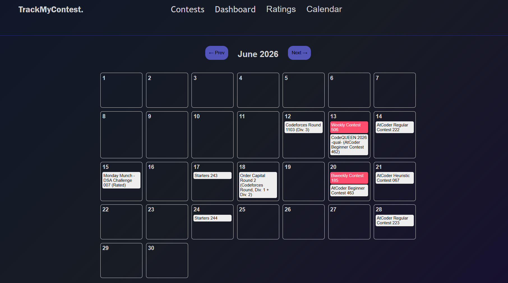

# Contest Tracker

A web application that helps competitive programmers discover and track upcoming coding contests from multiple platforms in one place.

## Features

* View upcoming contests from:

  * Codeforces
  * LeetCode
  * CodeChef
  * AtCoder

* Search contests by name or platform.

* Filter contests by coding platform.

* Save favorite contests for later.

* Dedicated Saved Contests page.

* Direct registration links to contest websites.

* Responsive and user-friendly interface.

* Persistent storage using Local Storage.

* Real-time contest data fetched from the CLIST API.

## Tech Stack

* HTML
* CSS
* JavaScript
* CLIST API
* Local Storage

## Screenshots

### Home Page



### Contest List



### Saved Contests



### Calendar View


## Installation

1. Clone the repository:

```bash
git clone https://github.com/your-username/contest-tracker.git
```

2. Open the project folder.

3. Run the project using Live Server or open `index.html` in your browser.

## Project Structure

```text
contest-tracker/
│
├── index.html
├── upcoming.html
├── yourcontests.html
├── style.css
├── script.js
├── yourcontests.js
└── assets/
```

## How It Works

The application fetches contest information from the CLIST API and displays upcoming contests from popular competitive programming platforms. Users can search, filter, save contests, and quickly navigate to contest registration pages.

## Future Enhancements

* Contest Calendar View
* Contest Countdown Timers
* User Rating Tracking
* Contest Notifications
* Dark Mode
* Personalized Dashboard

## Author

Developed by **Durgam Yashwitha Sri**.
